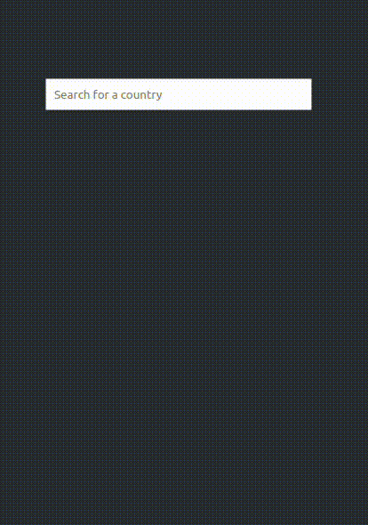

## Country Auto Complete Component

This is a simple country auto complete component that uses https://restcountries.com/ to get the list of countries.



### Demo

https://mdauner.github.io/auto-complete/

### Local Development

To run the project locally, run the following commands:

```bash
npm install
npm run start
```
